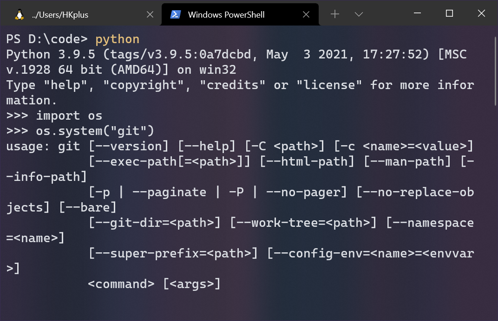
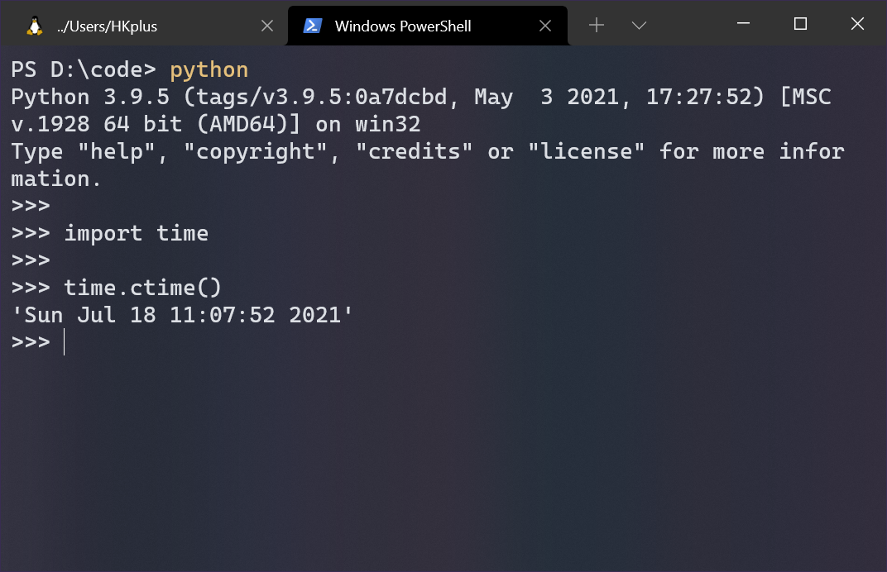

# 使用python制作自动同步git代码的脚本

> 基于windows环境的教程,linux和mac除了任务计划外同理
>
> 源码地址: https://gitee.com/auto_push

[toc]

## 描述

日常使用typora进行笔记记录或文档书写,typora本身没有云同步功能,借助坚果云文件大了之后文件丢失现象严重(可能是个例) , 使用百度网盘不可以进行在线预览,使用github的话每次都需要手动同步很麻烦 , 本文提供一种python+github实现个人云笔记的解决方法

## 通过python代码实现git同步

### 功能整理

需要程序在运行的时候自动同步,且自动设置`commit -m` 为当前时间以提醒最后一次更新的笔记时间,并且每次同步完成都在桌面新建一个同步日志,用于更直接的提醒同步时间

借助计划任务实现自动运行程序实现同步

主要功能如下:

### 实现准备

- 能够实现git自动同步
    - 需要使用python操作命令行
- `commit -m` 和 本地的提醒文件的时间信息
    - 需要使用python操作终端
    - 需要使用python获得当前的时间
- 在本地留下提示文件
    - 需要使用python操作文件

### python操作命令行的方法

可以使用python标准模块 ==os== 的`system()` 方法实现

`system()` 可以将以字符串形式作为参数的指令执行在命令行中



### python 获取当前时间

可以使用标准模块中得`time` 的 `ctime()` 方法获取易读的当前时间



### Python 在本地创建文件

可以使用`open()` 以写入的形式打开文件,如果文件不存在,就会创建文件并写入,如果存在就会覆盖原有内容写入新内容

```python
"""
此时文件结构如下:
code
 - demo.py
"""

# demo.py
file = open("./test.txt","w") # 此路径文件目前不存在 "w" 表示覆盖写入的形式打开
file.writ("test value")
file.close()  # 关闭文件

"""
此时文件结构如下:
code
 - demo.py
 - test.txt
 
 test.txt的内容是: test value
"""

# demo.py
file = open("./test.txt","w") # 此路径文件目前不存在 "w" 表示覆盖写入的形式打开
file.writ("hello World")
file.close()  # 关闭文件

"""
此时文件结构如下:
code
 - demo.py
 - test.txt
 
 test.txt的内容是: Hello World
"""
```

## 代码实现

**获取当前的时间**

```python
from time import ctime # 导入time模块中的ctime方法

def get_time():
    return ctime() # 获取当前时间并返回到函数调用处
```

**生成git指令并执行**

```python
from os import system # 导入os模块中的system方法

def create_git_order(time):
    """ 生成git指令并执行 """
    order_arr = ["git add *","git commit -m " + time,"git push origin master"] # 创建指令集合
    for order in order_arr:
        system(order) # 执行每一项指令
```

**在桌面建立提示文件**

```python
def put_file(time):
    """ 在桌面放置文件 """
    file = open(r"C:\Users\HKplus\Desktop\git_push_time.txt","w") # 此处的路径根据自己实际需求配置
    file.write(time + "完成最后一次提交")
```

**完整代码**

```python
from time import ctime, time # 导入time模块中的ctime方法
from os import system # 导入os模块中的system方法


def get_time():
    """ 获取当前时间 """
    return ctime() # 获取当前时间并返回到函数调用处

def create_git_order(time):
    """ 生成git指令并执行 """
    order_arr = ["git add *","git commit -m " + '"' + time + '"',"git push origin master"] # 创建指令集合
    for order in order_arr:
        system(order) # 执行每一项指令
    
def put_file(time):
    """ 在桌面放置文件 """
    file = open(r"C:\Users\HKplus\Desktop\git_push_time.txt","w") # 此处的路径根据自己实际需求配置
    file.write(time + "完成最后一次提交")

if __name__ == "__main__":
    date = get_time() # 获取时间
    create_git_order(date) # 提交到git
    put_file(date) # 在桌面创建文件
```

## pyinstaller

此时程序运行已经成功提交了,为了方便的分享 , 以及在不配置任何环境下的情况下实现定时自动运行 , 以及能够在想要运行的时候通过快捷方式直接运行提交 , 需要将程序打包成exe格式的可执行文件

需要使用 ==pyinstaller==

通过python安装时自带的`pip` 包管理工具进行下载安装:

```powershell
# 在命令行中执行下面的指令
pip install pyinstaller
```

> 如果是linux自带的python没有pip包管理工具,就是自行安装一个
>
> ```bash
> sudo apt install python3-pip
> ```

然后在刚刚的`demo.py` 所在目录下执行`pyinstall -F -w demo.py` 此处的`-F` 能够覆盖打包, `-w` 能够不包含终端打包

然后在打包过程中生成的文件夹`dist` 目录下找到`demo.exe` 这就是编译好的可执行文件,将他复制到笔记位置双击运行进行测试 

测试成功后可以创建一个指向`demo.exe` 的桌面快捷方式,方便之后随时快速的上传

## 实现自动化

使用windows的任务计划程序,实现自动运行自动上传脚本

1. 搜索并打开任务计划程序
2. 点击创建基本任务
3. 填写基本信息
4. 根据自己的需求设置触发器(建议登录时或每日固定时间)
5. 在操作设置中选择启动程序(**注意: 起始于(可选)  必须填!!! 填`demo.py` 所在位置  ** )
6. 选择刚刚打包的`deno.exe`
7. 点击完成,完成创建
8. 在任务计划程序库中双击刚刚创建的任务,勾选以最高权限运行


> 至此已经通过 python + 任务计划程序实现了自动化的git上传,就可以结合typora实现给予gitee的云笔记系统了(gitee不会偶尔连不上,如果 "上网稳定" 可以选择git)

 
